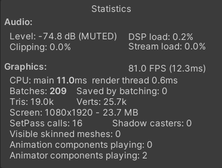
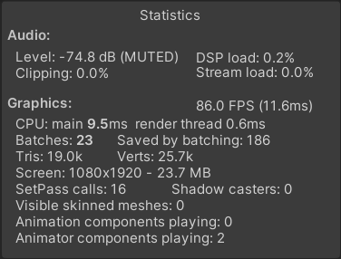

# Preamble
For the sake of reviewing, all modified game code will be labeled like this :

```csharp
// mod
// new code ...
// original
// old code ...
```

The folder "Documentation~" has been added to the project for the sake of providing screenshots in this document. This folder will be ignored by the Unity editor. Please view this file with a previewer (gitHub has one by default) to have the full experience.

## Optimizations

### Material batching

After inspecting the project materials in the folder [Materials](Assets/1_Graphics/Materials/) I identified several materials which were used on multiple objects in the scene.

To do this, I used the "_Find references in scene_" context option when clicking on a material asset.

- The [Water](Assets/1_Graphics/Materials/Water.mat) material is used in 81 scene objects.

- The [Cylinder](Assets/1_Graphics/Materials/Cylinder.mat) material is used in 184 scene objects.

Enabling GPU instantiation on both of those materials lowered batches from 31 to 25 and saved 184 (visible in the Statistics popup in the Game view) thus reducing draw calls. A minor increase in FPS can be seen (3~5 FPS).




### 2. 

## Pooling

- Added "BOOL_TILES_POOLING" to [RemoteConfig](Assets/3_Scripts/Utils/RemoteConfig.cs).

- Project uses "Theme" based structure, so I put my pooling system [here](Assets/3_Scripts/Tower/TilePool.cs).

- The tile pool prefab was placed in the main scene just under the "Tower" object.

- I used an extension method to place the `ReturnToPool` method directly in the `TowerTile` class, this makes it more coherent.

- TilePool has 2 public methods :

    `TowerTile GetTile(bool isNormal, int specialIndex, Action<TowerTile> Configure)` : Needs a description of which tile to provide. It will apply the provided configuration once the tile is selected from the corresponding pool.

    `void ReturnTile(TowerTile tile)` : Will deactivate the tile and make it available to be selected by `GetTile`.

- The configuration method injected in `GetTile` makes it easy to provide extra configuration if needed, depending on how the project spawned tiles before. I chose not to put all the configuration in it for the sake of keeping code untouched if it didn't need to be modified.